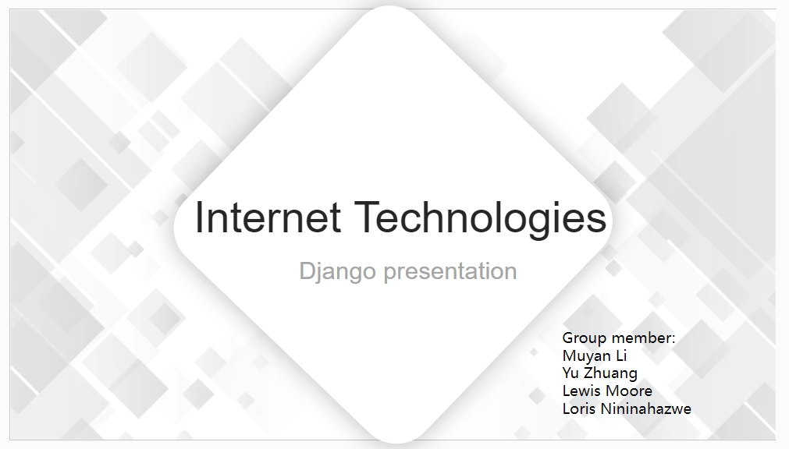
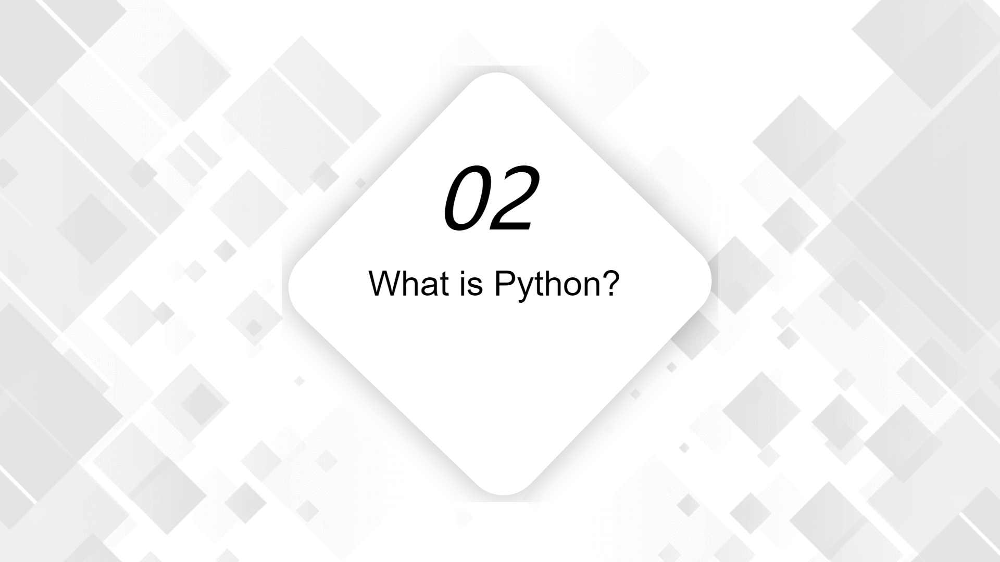
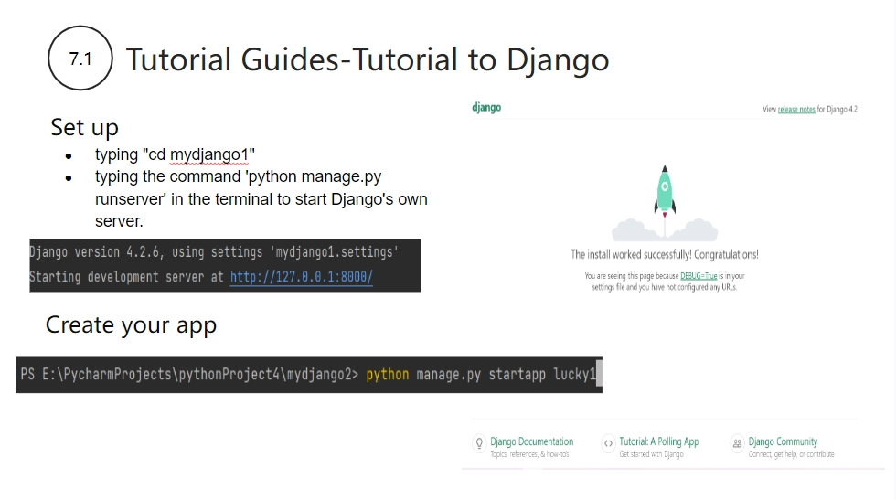

# Topic

# Contents

# Introduction

The first part focuses on a brief introduction to Django to give people an initial understanding of Django.

1. What is Django: Django is a Python web framework that aims to make web application development easier and more efficient. The framework is free and open source, and it provides a range of tools and features that can help you quickly build feature-rich web applications.[1] 
2. The history of Django:Django's history dates back to 2003, when it was created by Adrian Holovaty and Simon Willison.[2] Since then, Django has continued to evolve and grow with multiple releases, each bringing new features and improvements. Its stability and reliability have made it the framework of choice for many developers.  Django has now been updated to version 4.2.6, released in October 4, 2023. version 4.3 and 4.2.7 are still under development.[3]

### Python

* Python is a computer programming language created in 1991 by Guido Van Rossum as a successor to the ABC programming language. Python is known for its versatility and ease of use.
* Python is an interpreted, object-orientated, high-level programming language with dynamic semantics which means that it is executed line by line, supports OO principles such as encapsulation and inheritance, contains abstractions that simplify the complexity of tasks for developers, and the behavior of objects are determined during runtime instead of compile time which allows for an execution of code without knowing exact data types. [5]
* Python has access to a wide variety of libraries which make coding easier and more efficient, with many of these libraries being related to machine learning which Python specialises in. Examples being Pandas and TensorFlow which focus on manipulating data and training AI models. A non AI library would be Matplotlib that is used for graphing with numerial data. [6]

### Technology Interaction

* The primary development server for Django is WSGI which allows for interaction with web servers to handle HTTP requests and other related tasks.
* An example of web server than can be used with Django is Apache, which utilises the WSGI-compliant module 'mod_wsgi' and is capable of a variety of tasks. Apache can service static files, host multiple sites or applicationson the same server, URL rewriting (redirecting links), and using reverse proxies with other web tools like Gunicorn to optimise tasks, as some examples.
* Gunicorn is an example of a web application that is used through pip installation to Python and the 'gunicorn' command with a WSGI application. Gunicorn has a larger focus on the execution of Python web applications which makes it efficient in processing HTTP requests and generating responses, handling concurrent connections and horizontal scalability using multiple worker processes. However it cannot handle static files or URL rewriting while making it dependent on reverse proxies such as Apache for such tasks alongside handling complex routing. [7]
* On databases, Django supports multiple backends that include Django ORM, MySQL, and SQLite for example. A suitable database can be determined in the 'settings.py' file of a Django project using 'django.db.backends.(desiredSQL); 'settings.py' can also be used to detail the name of the database alongside the username and password. [8]

* Django has built-in user authentication tools using the 'django.contrib.auth' module, allowing a web applications/servers systems to handle the associated Authentication and Authorisaton features. These features include the implementation of user registration, login and passwords, restricting areas of an application, and overall providing an enhancment to security.
* An example of authentication would be to utilise '@login_required' to make areas restricted behind a security wall limited to authenticated users. An example of authorisation would be to use '@permission_required' or 'user.has_perm()' to enforce implemented authorisation rules. [9]
* Several other technologies exist that Django can utilise, one being middleware. Middleware components are used for processing requests and responses globally, additionally being used for to perform several tasks like authentication, logging, or modifying global requests and responses.
* API for creating RESTful APIs using Django REST framework to create, update, read, an delete data in a web application using HTTP methods and architectural principles.
* and Front-End Technologies involving HTML, CSS, JavaScript, and frameworks like React or Angular which allows for coders to create visually appealing and interactive web interfaces.

# Django VS Flask

The part 4 covers differences and similarity between Django and Flask.

* Released: Django is developed by Adrian Holovaty and Simon Willison, released in 2005. Flask is developed by Armin Ronacher, released in 2010. [10]
* Version: The latest Django version is 4.2.5  and the latest flask version is 2.
* Managing Project:Django follows a standard structure called a "Django module" which prescribes how applications should be organized and laid out. This can be helpful for large teams working on collaborative projects. Flask does not impose a specific project structure, giving developers the freedom to organize their code as they see fit. This flexibility can make development on smaller projects quicker and easier.[11]
* Diagram from Google trend: The diagram shows people's interest in Django and Flask in the past 5 years. Obvisouly, people were more interested in flask than Django. I guess that because flask is a newer framework than Django.

* Routing: When the request matches the URL pattern, the request object (request) that holds the HTTP request information is passed to the view, and then the view is called. Whenever you need to access the request object, you must pass it explicitly in the function. Django URLs and views are defined in separate files urls.py and views.py respectively. At its core, Flask uses Werkzeug, which is a Web Server Gateway Interface (WSGI) utility library in Python providing URL routing and request/response handling. In Flask, the request object request is global, so you can access it more easily (just import it). [12]
* ORM (Object-Relational Mapping): Django includes a built-in ORM system that simplifies database operations and model management, making database interactions more straightforward. Flask does not have a built-in ORM, but you can choose your preferred ORM library, such as SQLAlchemy, and integrate it into your Flask project.[11]
* Learning Curve: Due to the extensive built-in features and conventions provided by Django, learning Django can take more time, especially for beginners. Flask has a relatively lower learning curve because it offers fewer built-in features, allowing developers to build applications more freely. This also makes it a good choice for beginners in web development.
* Sites using these frameworks: Famous companies using Django are Instagram, Coursera, Udemy.Famous companies using Flask are: Netflix, Reddit, Lyft, MIT.

## Usage Scenario

* Using a web API.

The Django Rest Framework for APIs.[11] Django is the framework in Python, Django Rest Framework is the library available in Django to build Rest APIs.

Since Django is an extension of Python, if you are already familiar with the language, using it for your backend will make the process simple for you.

* Rest (Representational state transfer) api is a ruleset for building and using web services, structured to use HTTP methods like GET, POST, DELETE and PUT. These methods are ways to retrieve or create a resource. This allows easy communication between servers and clients. 

* The DRF is a helpful toolkit that helps users transforms their concept applications to a prototype as quickly as possible, handling issues such as validation and permissions in a familiar way to Django itself and its portability means easy communication with backend servers that use C#, Java and more.

### Documentation

* Django is well documented and searchable with a wide range of practical examples of good online documentation. Whether a developer has a problem or is new to Django, it's easy to find resources to solve problems and learn about Django.

* [12]Effective and easy to understand documentation is a key aspect of developing software and for REST APIs, a number of tools, like Swagger/OpenAPI can automatically produce interactive documentation. This expedites the development process and makes it simpler for developers to grasp how to utilise the API.

### DObject-Relational Mapper (ORM)

* Python is also called a batteries included language meaning the large libraries that come with it are all you need for full usability, for example react requires additional tools to handle tasks like routing or state management.[13]

* One of the features of django is its Object-Relational Mapper (ORM). Instead of writing sql queries you can use python to create a class that can be interpreted into a database.

* By default Django ORM will relate object attributes to corresponding table fields providing a level of abstraction. There is also support for database migration for large databases as well as an interface for the admin taught is easy to use. 

* Self-contained desktop management system admin: A complete backend data management control platform can be implemented with just a few simple lines of configuration and code.

### User Targeted Functionality

* [15]If the application you are building uses common features like logins and user authentication, django comes with many pre-built forms which can help you.
For example, working with forums can be a hassle, data has to be handled and validated before entering it into the database, error messages need to be displayed and successful entries need to be indicated to the user.

* Using Django forums, a lot of these steps can be simplified by giving you a framework to define the forums and fields as objects to handle the user validation and generate the HTML code.

* These tools include:
Password strength checking
Throttling of login attempts
Authentication against third-parties (OAuth, for example)
Object-level permissions

### Advantages and Disadvantages

### Advantages

* Security -  one feature of Django’s security is the protection from XSS (Cross-site scripting). These attacks occur when malicious scripts are injected into trusted sites, the script is transferred to the user from the browser side. [15]

* One way Django protects from these attacks is its Content Security Policy(CSP), in Django settings this can be configured to monitor the sources of the scripts and restrict where they are loaded. 

* Clickjacking is another type of attack protected in DJango. This is when a user is tricked into clicking on a hidden website using a decoy website with different content.  Django comes with  X-Frame-Options middleware which works in a browser to prevent a site from being layered on a frame.

### Advantages

* community - community support for open source frameworks are crucial to its success.
* Django’s community comprises professional developers and enthusiasts while the code is owned by the Django Software Foundation. Forums and discussing platforms are very active currently which means there are many ways to connect to fellow users.[16] Releases are usually available every 9 months with a roadmap available for the future.

* The extensive Community has 103k+ members on Reddit and 66.9k+ stars with 28k+ forks on GitHub, with more than 250K questions asked on stackoverflow according to Bacancy. Python ranks first in market share market of all the languages according to BrowserStack.
 
 ### Disadvantages 

* Learning curve -  Like most technologies there are downsides that came with developing in the Django framework. There can be a difficult learning curve that’s more pronounced with no history in python. There are specific ways to execute tasks which need to be learned before creating projects such as predefined variables which is why Django is described as monolithic. 

* Project size - Using Django comes with a lot of functionality which includes a lot of code. This can take a substantial processing power and time depending on the  equipment. For smaller sized projects which need little bandwidth Django can seem like overkill. For smaller projects its advised to use other web frameworks.

* While Django is one of the main frameworks of Python, looking at web frameworks as a whole and the market share. It is out ranked by several frameworks according to a 2021 Stackoverflow poll.

# Reference Notes & Tutorial Guides

The last part of the introduction focuses on Django's installation and Django's features.

## Tutorial to Django

This tutorial uses Python 3.11 and the IDE is PyCharm. The next tutorial will cover installing Django in PyCharm.
First the user installs Django using pip, Python's package manager, by typing 'pip install django' in the command terminal of pycharm to download and install the latest version of Django. Then, users use the 'python -m' method to invoke Django's commands to create projects without relying on the system's executable path. For example, typing python-m django startproject mydjango1 in pycharm's command terminal creates a project named mydjango1. Finally you can see the project you created on the lower right side of pycharm as shown below.

Note: Users can also create a new Django project with the 'django-admin startproject projectname' command. However, if you are able to successfully run python -m django --version to see the version of Django, but are unable to run the django-admin startproject mydjango1 command, this may be due to the fact that Django's executable command, django-admin, has not been added to the system's executable path. In order to solve the problem of not recognising django-admin without relying on the system executable path, the 'python -m django startproject mydjango1' command is used here to create a new Django project.

 
This section describes the installation of Django packages in PyCharm, which are designed to provide support and easy functionality when developing Django applications in PyCharm.
1. Open PyCharm and open your project.

2. Go to "File" > "Settings" In the Settings dialogue box, expand "Project: YourProjectName" and select "Python Interpreter". Under the "Python Interpreter" tab, you will see the current Python interpreter for your project. Usually, you will find the system's default interpreter in the list.

3. Click the "+ (plus sign)" button in the upper right corner and select "Search for packages".

4. Type "Django" in the search box and press "Enter".

5. You will see a list of Django packages and their available versions. Select the version of Django you want to install (usually the latest version) and click the "Install Package" button.

6. PyCharm will automatically download and install the selected Django package.

7. Once the installation is complete, you can see the entry for the Django package in the "Python Interpreter" tab. As shown in the image below.

This section describe Setting up Django. 
After installing Django inside pycharm, the user enters the mysite directory by typing "cd mydjango1" in the pycharm command terminal and executes subsequent commands in that directory.

After completing the above steps, start Django's own server by typing the command 'python manage.py runserver' in the terminal. Then, a link to the Django server will appear, User click to enter the server page.

Note: Shortcut key 'Ctrl+C' to switch off the server.

Finally, you should enter 'python manage.py startapp lucky1 to create your application which is called lucky1.

The next two examples will illustrate the main features of Django. 

* In the first example, We first create a 'Hello world' view to familiarise the user with the basic request and response process. And it covers some of the basics in Django, such as URL Routing and view functions. 
URL routing and views：Django provides a powerful URL routing system that maps URLs to view functions, allowing you to handle different web requests.

*  Open the file lucky1/views.py and put the above code in it. The purpose of this code is that when the user accesses the URL/index/ in a browser, the index will be invoked and the message "Hello world. It's lucky1 index." will be displayed as an HTTP response.

*  Chart on the lower left: Defines a URL pattern that maps the root path (empty path) to the index view function. 
The lower-left image shows the URLs for a Django application called "Lucky1". The purpose of this code is to define the home page of the application. When the user accesses the root URL of the application, the views.index view function will be executed and this function will generate an HTTP response containing a specific message. In this way, it is possible to create a simple welcome page or home page for the application.

* Chart on the top right: Perform URL routing configuration and distribution. 
The image in the top-right corner shows the code for URLs file of a Django project called "mydjango2". The purpose of this code is to integrate URL routing from different applications into the main project and provide an administrative backend for managing application data. This is the main URL profile for the Django project and it determines how requests will be routed to different applications and views.

It is final page showcase. you can open the Django server by typing python manage.py runserver in the pycharm terminal, and visit http://localhost:8000/lucky1/ in a browser.

After familiarising themselves with basic requests and responses, users will set up a database, create a site related to polls and voting, and get a quick introduction to Django's auto-generated administration site. 
Database model：Django includes an ORM (Object-Relational Mapping) system that enables you to define the database model without having to write SQL code. This allows you to easily interact with the database.
1. Database settings 
When you first create a Django project or install a new application, you usually need to run python manage.py migrate to create database tables to match the model definition. This is part of database initialisation.

2. Creating Models 
Use the two model classes defined in Django: Question and Choice. These model classes are used to create database tables that store information about questions and options also so that you can create, retrieve, update, and delete data about questions and options in your application.

It is the second example for polls and vote on public websites.In this section the two main Tables created are Question and Choice.

3. Activation Models 
The most important part of this section is to create the database migration files and apply the database migration. 

Create database migration files: Migration files are generated based on model changes and saved in the application's migrations directory.
<pre>
python manage.py makemigrations
</pre>

Apply Database Migration: Once the migration file has been created, you will need to apply the changes to the database to ensure that the database structure is consistent with the model. This can be done with the following command:
<pre>
python manage.py migrate
</pre>
 Activating the model is a key operation to ensure that the database remains consistent with the model definition of the Django application. This helps to ensure the correctness and consistency of the data store, while enabling the application's data structure to evolve appropriately over time.

 4. Administration Backend

The purpose of this code is to connect the Question model in your application to Django's backend admin interface so that you can easily manage and maintain the question data in your application without having to manually code the admin interface. 
Administration Backend: Django's auto-generated administration backend allows you to easily manage the content of your website, including the creation, editing and deletion of database records.

5. Django's  other main available Features

Django has other useful features too. 
* Security: Django provide some security mechanism to prevent malicious websites or files. 
* Caching: Django provides a caching framework that speeds up site load times and reduces server load. 
* Forms processing:Django provides form handling features that simplify form creation, validation, and processing. This includes features such as CSRF protection, form rendering, and more. 
* REST framework: Django REST framework is a powerful framework for building RESTful APIs that enables you to easily create web services. 
* Static File Management: Django allows you to manage and serve static files (such as CSS, JavaScript, and images), making them easy to integrate into your website.

6. Finished product display

Username:admin 
password:123456admin 
When entering the login page enter the correct user name and password will enter the admin home page. Admin page has three forms, when you fill in the relevant content and submit, the relevant content will be displayed in the lower right corner of the My actions inside the show.

This is group page and user page.

## Reference

This is our reference.

